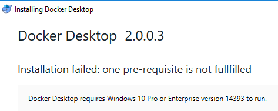
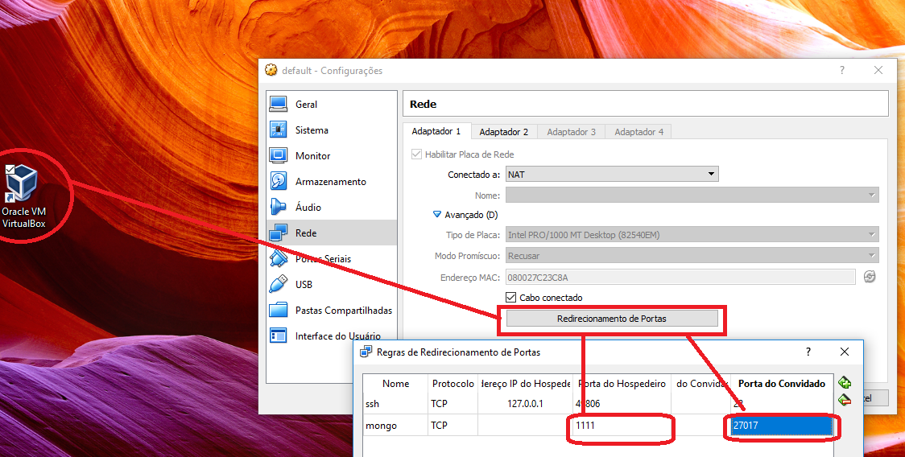

Curso de Node da [RocketSeat](https://rocketseat.com.br/starter/curso-gratuito-nodejs). 

You will need [Node/npm](https://nodejs.org/en/download/) to run this project.

After install, open your prompt:

```PowerShell
npm install
```

After you just need start:
```PowerShell
node server.js
```

# Install Docker (Windows:Mode)
Download docker:
https://hub.docker.com/editions/community/docker-ce-desktop-windows  

Ps: You'll need [account in Docker](https://hub.docker.com/signup)  
RUN AS LINUX ok?!


Ps²: 

If you use Windows 10 Home and get this error when install Docker-CE  
     
You should download [DockerToolbox](https://download.docker.com/win/stable/DockerToolbox.exe) instead of Docker-CE


## Add Mongo in docker
```PowerShell
docker pull mongo
```

## Run Docker: (Curso)
```PowerShell
docker run --name mongodb -p 27017:27017 -d mongo
```


## Run Docker: (ToolBoxMode Nobody likes$ Win10-Pro)

Run mongo with this params:
```PowerShell
docker run --name database -d -p 27017:27017 mongo --noauth --bind_ip=0.0.0.0
```

In Oracle VM VirtualBox -> Tab Network, you'll need port fowarding:  
Port Host: `27017` 
Guest Host: `1111` 
 


Access URL in Chrome: `http://192.168.99.1:1111` to test, you should recive this response:  
`It looks like you are trying to access MongoDB over HTTP on the native driver port.`  
PS: `192.168.99.1` its my ipv4's vm. 


## List all dockers (actives)
```PowerShell
docker ps
```
* `-a` <- list all, include turnOff dockers 


## Start docker 
```PowerShell
docker start [NAME_OF_IMAGE]
```

# Client for MongoDb:
[Download Robo 3T](https://robomongo.org/download)  