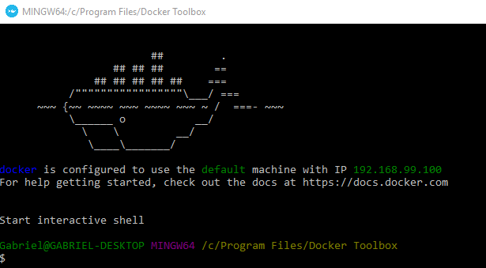
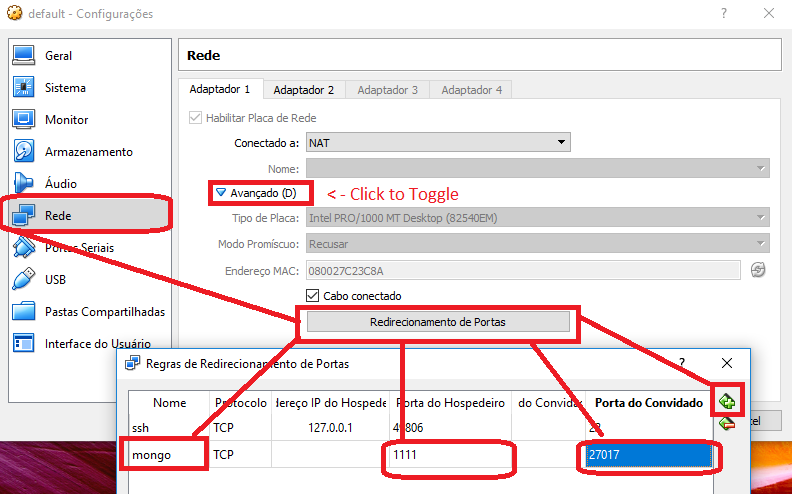

Curso de Node da [RocketSeat](https://rocketseat.com.br/starter/curso-gratuito-nodejs). 

Construção de APIs REST utilizando o NodeJS, back-end utilizando o JavaScript.
* Uso de NPM.
* Uso de Docker.
* Criação de rotas.
* Criação de Controllers.
* CRUD no Mongo.
* Utilizar as libs: 'nodemon', 'require-dir', 'mongoose', 'express', 'cors'.


---

You will need [Node/npm](https://nodejs.org/en/download/) to run this project.

After install, open your prompt:

```PowerShell
npm install
```

Start Server (static server):
```PowerShell
node server.js
```
Start Server (Dynamic server with nodemon `devDependencies`):
```PowerShell
npm run dev
```


# Install Docker (Windows 10 Professional Edition:Mode)
Download docker:
https://hub.docker.com/editions/community/docker-ce-desktop-windows  

Ps: You'll need [account in Docker](https://hub.docker.com/signup) for download.


-> Install `Docker-CE`

Ps:  
If you use `Windows 10 Home Edition` and get this error when install `Docker-CE` 
     
You should download [DockerToolbox](https://download.docker.com/win/stable/DockerToolbox.exe) instead of Docker-CE and fallow this steps:  
* [`Install Docker ToolBox (Windows 10 Home Edition:Mode)`](https://github.com/gabrieldarezzo/nodejs-curso#install-docker-toolbox-windows-10-home-edition-mode)

## Run Docker:

### Add Mongo in docker
```PowerShell
docker pull mongo
```

### Run mongo
```PowerShell
docker run --name mongodb -p 27017:27017 -d mongo
```

### Simple Test Mongo over HTTP:
Access URL in Chrome: `http://192.168.56.1:1111` to test, you should recive this response:  
 


---

# Install Docker ToolBox (Windows 10 Home Edition:Mode)


Download and install: [DockerToolbox](https://download.docker.com/win/stable/DockerToolbox.exe).  
->  Because Nobody $likes$ Win10-Pro

## Run Docker:
Open `Docker Quickstart Terminal`  
 

Wait for this screen:  
  


In prompt of `Docker Quickstart Terminal` pull mongo:
```PowerShell
docker pull mongo
```

Run mongo with this params:
```PowerShell
docker run --name database -d -p 27017:27017 mongo --noauth --bind_ip=0.0.0.0
```

In Oracle VM VirtualBox, get conf:  
 

* Now in Tab `Network`, you'll need port forwarding:  
Port Host: `27017` 
Guest Host: `1111` 
 


### Simple Test Mongo over HTTP:

in prompt, `ipconfig`, you need check IPv4 of: 'VirtualBox#1', 'VirtualBox#2':
```
Adaptador Ethernet VirtualBox Host-Only Network:
   ...
   Endereço IPv4. . . . . . . .  . . . . . . . : 192.168.56.1
   ...

Adaptador Ethernet VirtualBox Host-Only Network #2:
   ...
   Endereço IPv4. . . . . . . .  . . . . . . . : 192.168.99.1
   ...
```

Just enter one of then `[http://IP:PORT]` in Chrome.  
In my case `http://192.168.99.1:1111` I received this response:  
 

Work like a charm in Win 10 Home :laughing: :smiley: :laughing:

More troubleshooting in this site:  
https://codehangar.io/mongodb-image-instance-with-docker-toolbox-tutorial/

---
# Commands in Docker:

## List all dockers (actives)
```PowerShell
docker ps
```
* `-a` <- list all, include turnOff dockers 


## Stop Img
```PowerShell
docker stop [IMAGE_ID]
```


## Remover Img
```PowerShell
docker rm [IMAGE_ID]
```
    

## Start docker 
It's good when you restart your machine.
```PowerShell
docker start [NAME_OF_IMAGE]
```

# Client for MongoDb:
[Download Robo 3T](https://robomongo.org/download)  


I created `sender.html` to test CREATE,UPDATE,DELETE routes, `cors` already enable in this project.


